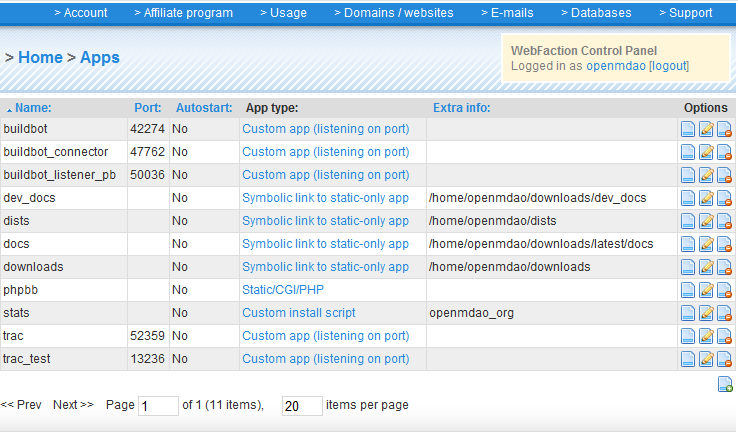
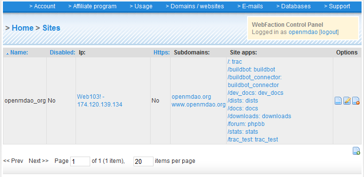
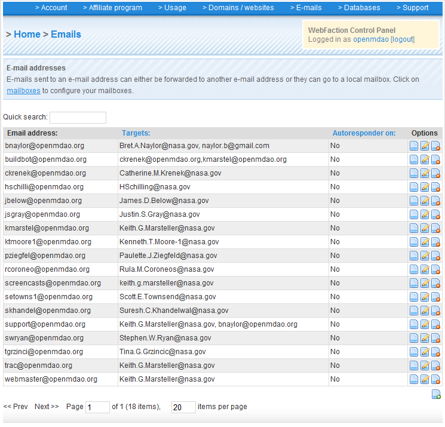

WebFaction
==========

The OpenMDAO website at ``openmdao.org`` is hosted by WebFaction.  

Connecting
-----------
     
**SSH:**
		   
  `server:`  ``web103.webfaction.com``

  `username:`  openmdao

  `password:`  (see password file)

**Control Panel:**
  
  Control Panel `login` is at ``panel.webfaction.com`` and uses the same login information as the SSH.
 
  `Domains:`  Enter ``openmdao.org`` and ``www.openmdao.org``.

  `Apps:`  This is where all of the apps that run this website get routed to their part of the website and/or get their port numbers.        

|
    
  `Websites:` Make sure that the site's apps have URLs that are directly reachable. Here's the current mapping of site apps:

|

  email addresses ``@openmdao.org``:

Organization/File Structure
----------------------------

**Dists:**    

 The ``dists`` directory is for holding local versions of packages that might need to be installed (e.g., scipy) instead of having to search 
 other sites to find them.  Whenever a new package is added, the webpage at ``openmdao.org/dists`` needs to be updated. To do
 that, you must run Python 2.6 on the ``mkegglistindex.py`` file in the ``dists`` directory.  

 ::

   python2.6 /home/openmdao/dists/mkegglistindex.py

 After running the script, check the page to make sure that it worked.
		
**Downloads:** 

 Releases of OpenMDAO reside here.  This folder also contains a script that creates the page at ``openmdao.org/downloads``; each version directory has its own
 page that needs to be generated. These instructions are from ``/home/openmdao/downloads/README_TO_UPDATE``:

 To update downloads pages:
 
 1. First, cd into the most recent folder and then run ``python2.6 dlversionindex.py``.

 2. Then cd back up to this level and run ``python2.6 mkdownloadindex.py`` in this directory.

 3. Check ``openmdao.org/downloads/`` to make sure that your efforts worked. 
 
 
Trac
=====

Trac (``trac.edgewall.org``) is the project management/issues tracking software that OpenMDAO uses as the basis of
the website. 

- The Trac environment lives in: ``/home/openmdao/OpenMDAO/Trac``.  

- Inside the ``conf`` directory is where the ``trac.ini`` file lives.  ``trac.ini`` runs the whole show.  Nearly
  everything on the website is affected by this file. 

- To run the Trac server again if it has crashed, go to ``/home/openmdao/OpenMDAO/Trac`` and type: 

  ::
 
    ./RUN_ME_to_RUN_TRACD

  which contains:

  ::

     tracd --single-env --port 52359 	
     --basic-auth="Trac,/home/openmdao/OpenMDAO/Trac/trac
    .	
     htpasswd,OpenMDAO_Trac" /home/openmdao/OpenMDAO/Trac 
     --daemonize

- The ``plugins`` directory is where all the various plugins must be installed. 

  The following plugins, available at ``trachacks.org``, are installed in ``openmdao.org's`` Trac installation.
 
  ::
 
    BatchModify 0.2.0:  		   Allows batch modification of tickets
    BlackMagicTicketTweaks 0.1: 	   Various simple hacks to alter the behavior of the Ticket forms.
    BreadCrumbsNavPlugin 0.1: 	   Shows the last several places that you have been.
    IniAdmin 0.2:  		   Expose all TracIni options using the Trac config option API
    TicketImport 0.7c:  		   Import CSV and Excel files
    TicketModifiedFiles 1.00:  	   Trac plugin that lists the files that have been modified while resolving a ticket
    TicketSubmitPolicy 0.8:  	   Trac plugin to dictate ticket form submission policy for new and existing tickets
    TracAccountManager 0.2.1dev:    User account management plugin for Trac
    TracBuildbot 0.1.3:  	   A plugin to integrate Buildbot into Trac
    TracBzr 0.2:  		   Bazaar plugin for Trac
    TracDiscussion 0.7:  	   Discussion forum plugin for Trac
    TracFullBlogPlugin 0.1.1-r7774: Full-featured and self-contained Blog (front page)
    TracMasterTickets 2.1.3:  	   Support for ticket dependencies and master tickets.
    TracMenusPlugin 0.1
    Trac Menus
    TracSpamFilter 0.2.1dev-r8929:  Plugin for spam filtering
    TracWysiwyg 0.2:  		   TracWiki WYSIWYG Editor
    cc-selector 0.0.2:		   Visual cc editor for Trac
    tractab 0.1.3-Genshi

**Setup:**
	
**Administration:**
	
**Blog:**

Webapps
=======

 
 
Torpedo 
========

Torpedo is OpenMDAO's Linux server. Backups of WebFaction are run on torpedo, and so is Buildbot.

Backing Up WebFaction
---------------------
		
**Cron:**
		
 Keith's home directory contains a script that backs up the ``web103.webfaction.com`` content every day. The cron job in
 the crontab looks like this:

			
 ::
 
   00 02 * * *  /home/kmarstel/bin/backup_website >> 	          
   /home/kmarstel/WEBSITE/website_backup.log 2>&1

		
**Script:** 
 
 The very simple script that does the actual backing up of the website lives in ``/home/kmarstel/bin/backup_website``, as
 noted in the cron entry above.  It looks like this:

 ::
 
   cd /home/kmarstel/webfaction_backup/
   #Perform the web backup using rsync
   rsync -arvzt -e ssh 	
   openmdao@web103.webfaction.com: .
   
  
 
Running Buildbot
----------------- 

Buildbot automatically builds and tests OpenMDAO. The buildmaster lives on ``torpedo.grc.nasa.gov``, and the
control page is served on torpedo at:  ``http://localhost:8011/``. 

*Actual Buildbot Master*
~~~~~~~~~~~~~~~~~~~~~~~~~

**Location:**
		
 The buildbot master lives on torpedo at ``/OpenMDAO/buildbot/master``.

**Configuration:**
			
 All of the settings for how the buildbot master is set up are located in the master directory under ``master.cfg``.  Not only
 does this extensive file set up the master, it also determines which bots will connect to the master.

**Running the Master:**

			
 To run the buildmaster, you should be root or have root run it. It should be set in a special place to run:
    
* BUILDBOT 

  The path to buildbot is:
      
 ::
    
   /usr/local/lib/python2.6/site-packages/scripts/buildbot

* CREATE A BUILDMASTER
    
  To create the master, use:

 ::
     
   buildbot create-master  BASEDIR

 where ``BASEDIR`` is the base directory. For purposes of the main project, it should be the ``/OpenMDAO/buildbot`` directory.
   
 ::
  
   buildbot create-master /OpenMDAO/buildbot/master
   
 Once the master has been created, edit the ``/BASEDIR/master.cfg`` file that holds all of the specifics on settings, slaves and connections.
   

* CREATE A BUILDSLAVE

 ::
    
   buildbot create-slave SLAVEDIR MASTERHOST:PORT SLAVENAME PASSWORD

 - SLAVENAME and PASSWORD are defined in ``/BASEDIR/master.cfg``
 - Some settings are available in ``/SLAVEDIR/buildbot.tac``
 - Slave admin and slave info files reside in ``SLAVEDIR/info/host`` and ``SLAVEDIR/info/admin``, and should be edited.
 - Code that created our buildslave named `torpedobot`:

 ::
    
   buildbot create-slave torpedobot torpedo.grc.nasa.gov:31000 torpedobot "bot1passwd"

* STARTING THE MASTER AND SLAVE

 To actually **start** the master and slave, use these commands:

 From above ``BASEDIR``, start the master:
   
 ::
   
   buildbot start mastername 
   buildbot start master 
   
 OR
   
 ::
   
   buildbot start /OpenMDAO/buildbot/master

 From above ``SLAVEDIR``, start the slave using ``buildbot start slavename``:

 ::
 
   buildbot start torpedobot  
   
 OR
   
 ::
 
   buildbot start /OpenMDAO/buildbot/master/torpedobot

* RESTARTING THE MASTER OR SLAVE

 To restart either service:
 
 ::
 
   buildbot restart master

 AND/OR
 
 ::
 
   buildbot restart torpedobot

 Execute from the appropriate directory. If you're not in the appropriate directory, you need to use the full path to the master
 ``directpru`` or ``torpedobot`` directory. For example:

 ::

   buildbot restart /OpenMDAO/buildbot/master
   buildbot restart /OpenMDAO/buildbot/master/torpedobot

 If errors come up when trying to start/restart the buildmaster, check the viability of the config file with the following command:

 ::
 
   buildbot checkconfig OpenMDAO/buildbot/master/master.cfg

*Buildbot Slave on Torpedo*
~~~~~~~~~~~~~~~~~~~~~~~~~~~

Every fifteen minutes, a cron job starts up that copies the pertinent Buildbot data to a *fake* buildmaster up on
``web103.webfaction.com``.  This makes build data available at ``openmdao.org/buildbot``.  The command that runs in crontab is:

::
  
  00,15,30,45 * * * * 
  /usr/local/lib/python2.6/site-packages/scripts/fab -f 
  /OpenMDAO/buildbot/master/fabfile.py update_bb >> 
  /home/kmarstel/WEBSITE/buildbot_update.log 2>&1

Configuration
  
Running where?
  
Copying from Torpedo's BuildMaster to the website

GoDaddy.com
===========
	
**Account information:**
		
  *user:* OpenMDAO
  
  *pass:* (see password file)
  
  *PIN:*  (see password file)
  
  *Customer number:* #24120551
	
  *Names:*  ``openmdao.org``  (``openmdao.net, openmdao.com,`` and ``openmdao.info`` are set up to redirect to ``www.openmdao.org``).
	    
  *Renewal:*  Domain names are held until 10/24/2018.
	
  *Tying to WebFaction:*  In the godaddy account, the nameservers ``NS1.WEBFACTION.COM`` (NS1 through NS4) are used.

